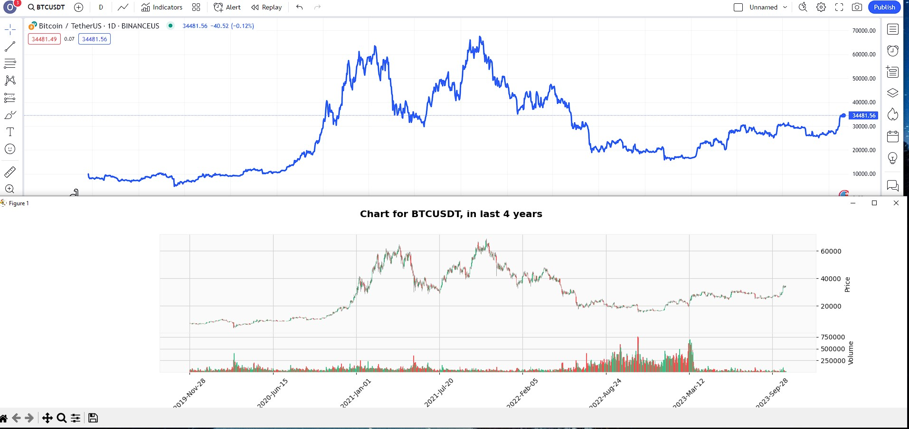
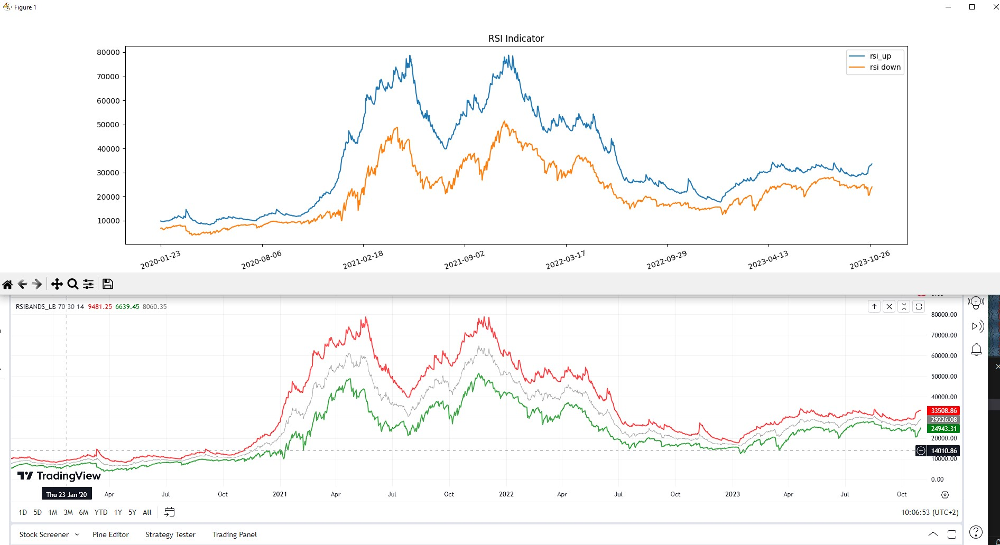
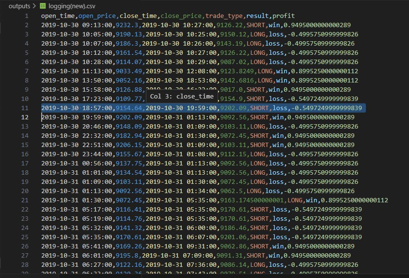
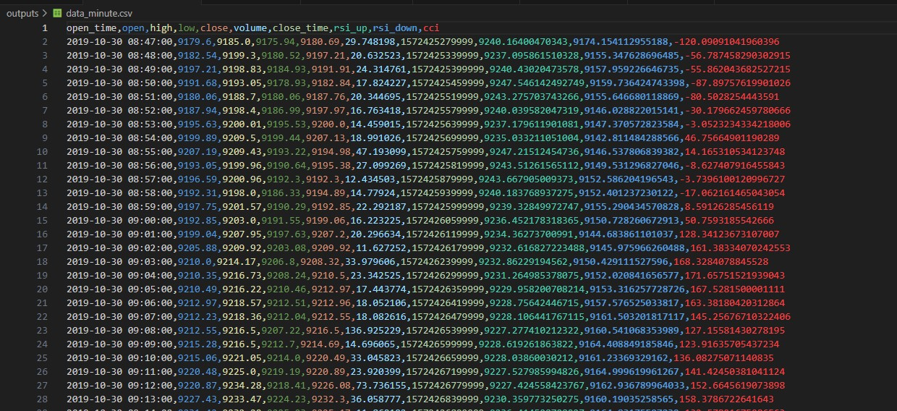
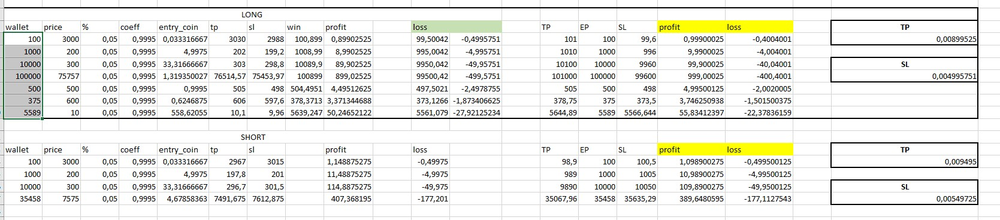

# Python Strategy Script

The script provides a trading strategy that takes quote history as input, calculates the CCI and RSIBANDS_LB indicators, and returns signals to start or end trades

## :memo: Table of Contents

- [Installation](#rocket-getting-started)
- [Script usage](#computer-script-usage)
- [TODO](#hammer-todo)
- [Screenshots](#Demo)


## :rocket: Installation 

1. **Create environment:**
   ```
   python -m venv venv
   ```
      and activate it:
   - on windows
        ```shell
        venv\Scripts\activate 
        ```
   - on macOS or Linux:
        ```bash
        source venv/bin/activate 
        ```

2. **Install requirements**
   ```
   pip install -r requirements.txt
   ```
3. **Create .env**  
    ```
    rename
    .env_sample  ->  .env
    ```

4. **Fill your secret keys to .env file**


## :computer: Script usage

1. **Setup script**
    ```
   configure settings.json file regarding your necessity
    ```
2. **Run**
   - on windows
        ```shell
        python main.py
        ```
   - on macOS or Linux:
        ```bash
        python3 main.py
        ```


## :hammer: TODO

1. **Add module for managing files:**

   ```
   Create a package for reading and writing data-frames to file and remove corresponding methods from other classes.
   ```
2. **Create interfaces for less dependencies between classes**

3. **Add module for charts**

4. **What is the better speed: pass the whole data-frame or slice?**

5. **Create interface for loggers**


## Demo





